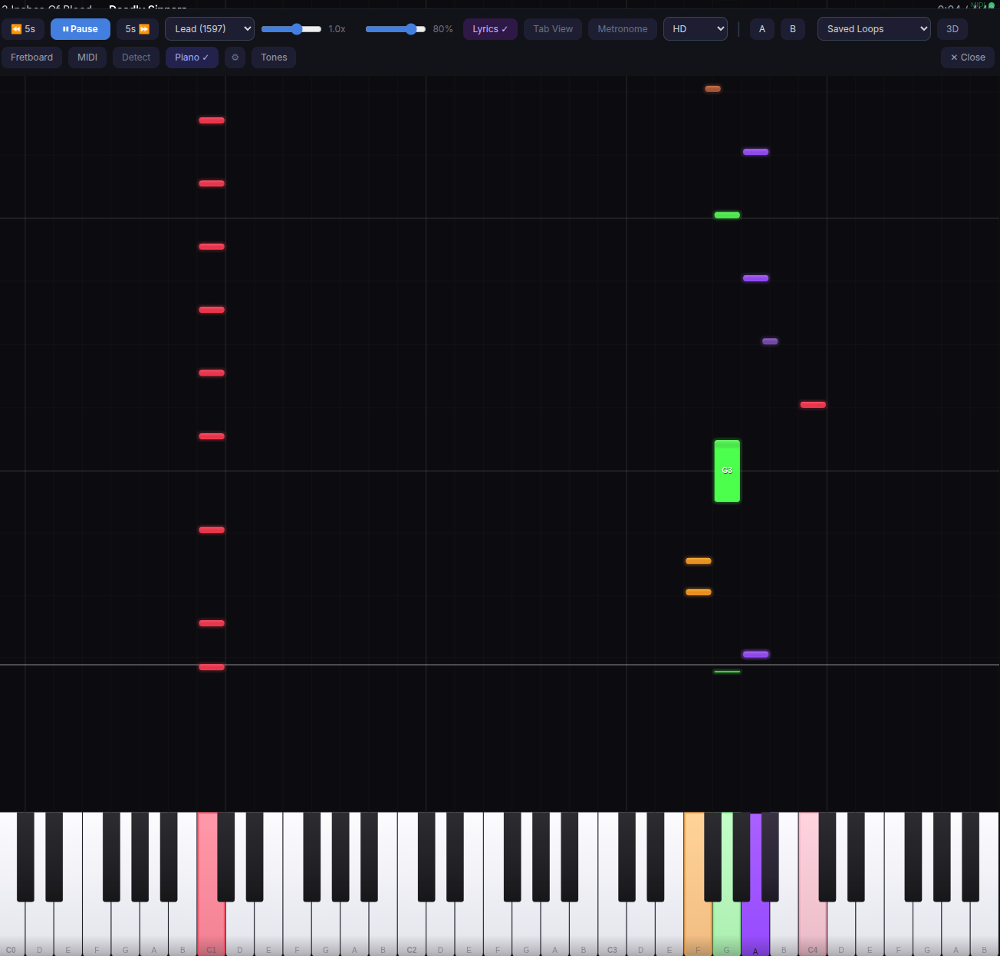

# Slopsmith Plugin: Piano Highway

A plugin for [Slopsmith](https://github.com/got-feedback/feedback) that replaces the guitar highway with a Synthesia-style scrolling piano view, with MIDI keyboard input and a built-in software synthesizer.



## Features

- **Scrolling piano view** — notes fall from top to bottom onto a rendered keyboard, Synthesia/Openthesia-style
- **Neon rainbow colors** — each chromatic pitch gets a unique neon color with multi-layer glow effects
- **Polished keyboard** — 3D gradient shading, rounded corners, press-down animation, and approach color lerping as notes get closer
- **Dynamic zoom** — keyboard auto-scales to show only the octaves with active notes, snapping in clean octave steps
- **Auto-activate** — switches on automatically for Keys/Piano/Synth arrangements
- **MIDI keyboard input** — connect any USB MIDI keyboard via Web MIDI API to play along
- **Hit/miss feedback** — keys glow green for correct notes, blue for freestyle, red for wrong notes
- **Built-in synthesizer** — WebAudioFont-powered playback with 10 GM instruments (Grand Piano, Electric Piano, Organ, Strings, Synth, and more)
- **Accuracy scoring** — optional hit detection with accuracy %, streak counter, and best streak tracking
- **Sustain pedal** — full MIDI CC#64 sustain pedal support
- **Inline settings** — MIDI device, instrument, volume, channel, transpose, and toggles all accessible from the player

## Requirements

These are four independent prerequisites — satisfying one does not imply the others. The first three are requirements: core compatibility, browser support for MIDI, and network access for the built-in synth. The fourth is an optional peer plugin that decides what Piano can do when several panels are open at once. Each is checked separately below.

### 1. Host: feedBack core v0.3.0-alpha.1 or newer

Piano Highway declares a **minimum host of feedBack v0.3.0-alpha.1** — the first core commit whose `VERSION` file reads `0.3.0-alpha.1` (commit `803bd0c`), and the earliest snapshot whose source carries every API this plugin consumes. Core publishes no git tags, so `VERSION` (surfaced by core's version endpoint) is the identity to compare against.

Rows are grouped by what the plugin can *do* when the host provides them, not by whether a missing one would break the board — nearly every row is read behind a `typeof` or existence check, so a dropped API degrades a feature rather than the renderer:

- **The board itself** — the factory global, the `setRenderer` lifecycle, `matchesArrangement` (and the `songInfo` fields it reads) and the chart bundle fields. Without these the visualization does not appear at all.
- **MIDI keyboard input** — the `midi-input` domain and the bus event that reconciles plugged/unplugged devices. Without these the board still renders, but there is no keyboard to play, and both the synth and hit detection are driven by played notes, so neither is available (see *Visualization-only fallback* below).
- **Host chrome** — the event bus and its `highway:` events, `uiVersion` / `ui.playerControlSlot()`, and `window.highway.resize()` *(optional)*. These affect where the settings gear sits and when the overlay re-syncs; `highway:visibility` additionally reaches the board's own visibility, since a host hiding its highway is expected to hide the overlay with it.

| Host API | Used for |
|---|---|
| `window.feedBackViz_<id>` factory global | Renderer discovery by the visualization picker — core's picker resolves this name and no other. `window.slopsmithViz_<id>` is the same function under its legacy export name, kept for splitscreen's `VIZ_FACTORY_PREFIXES` fallback, which core itself never reads |
| `setRenderer` lifecycle: `contextType`, `init`, `draw`, `resize`, `destroy` | Mounting and teardown |
| `matchesArrangement(songInfo)` | Auto-mode arrangement matching |
| Chart bundle fields: `isReady`, `currentTime`, `notes`, `chords`, `beats`, `chordTemplates`, `toneChanges`, `toneBase` | Rendering, chord labels, measure-aware retargeting, auto tone |
| `songInfo.arrangement` / `arrangements` / `arrangement_index` / `has_notation` | Auto-mode matching on the top-level arrangement name, or the active entry in `arrangements`; `has_notation` + the active entry's note count is how a notation-only keys arrangement yields to a notation visualization |
| Event bus (`window.feedBack.on` / `.off`, plus the legacy `window.slopsmith` alias) and `highway:canvas-replaced` / `highway:visibility` | Overlay re-sync on host canvas replacement and visibility changes |
| `midi-input:sources-changed` on that bus | MIDI device plug/unplug reconciliation |
| `midi-input` domain **v1** via `window.slopsmith.midiInput` — `discover`, `listSources`, `select`, `open`, `close`, `logicalSourceKey` | MIDI keyboard input |
| `feedBack.uiVersion` + `feedBack.ui.playerControlSlot()` | Settings gear placement in the v3 player |
| `window.highway.resize()` *(optional)* | Nudges the host's measure pass after the plugin changes player-control layout |

`tests/host-compat.test.js` pins this floor as an executable contract: each fake host in that file reproduces the rows above, and the renderer must mount, draw, route MIDI, survive pause/seek/song changes, and tear down against it. Every test in that file runs only against those fixtures, never against a live core; the evidence for `0.3.0-alpha.2` (`3a4dd7a`) is a source audit of the same APIs, whose surface is a superset of alpha.1's — the two `setRenderer` / `matchesArrangement` sites moved from `static/app.js` to `static/js/viz.js`, with no change to the published contract.

This is a source-level compatibility floor, not a runtime certification of every historical snapshot: no test here claims that all builds older than alpha.1 fail, only that alpha.1 is the earliest one examined that provides everything the plugin needs.

**Visualization-only fallback.** The renderer and MIDI input have different requirements. The scrolling piano view works on a visualization-only host — a core with no `midi-input` domain, or one whose domain is not v1, still renders the board; what is lost is everything reachable only from a played note — the MIDI device list, note-on/note-off, the synth voice it triggers, and hit detection — and the settings panel shows an empty device list. The synth is a monitor for what you play, not a backing track: nothing in the plugin sounds a note on its own. Likewise, a host with no event bus falls back to plain `window` events, and a host without the full `window.slopsmithSplitscreen` helper runs the single-panel focus path (see requirement 4).

### 2. Browser: Web MIDI support for MIDI keyboard input

MIDI input needs the **Web MIDI API**, which every implementing browser exposes only in a **secure context** (HTTPS, or `localhost`). Chrome and Edge implement it; Safari does not. Firefox implements it from version 108, where the first `requestMIDIAccess()` call with a MIDI device attached prompts the user to install a Site Permission Add-On — without it the API stays unavailable. Core's `discover()` is the permission boundary, i.e. what calls `requestMIDIAccess()`.

The permission prompt is part of the requirement: a denied or dismissed prompt leaves MIDI unavailable until the user re-allows it in the browser's site settings, and a `midi` Permissions-Policy header that excludes this origin rejects the call outright. Chrome and Edge are the browsers this plugin is tested against; Firefox is expected to work as described but is not covered by the test suite.

MIDI features are optional — the piano view works without a MIDI keyboard.

### 3. Network: WebAudioFont for the built-in synthesizer

The instrument playback is **WebAudioFont**-based. On first use the plugin loads `WebAudioFontPlayer.js` and the soundfont data from `surikov.github.io`, so built-in sound needs network access (or a reachable cache) and an `AudioContext` the browser will allow to start — most browsers block audio until a user gesture, so the first note may need a click on the player. If either the script or the soundfont fails to load, the plugin logs a warning and everything except audio keeps working; note visuals, MIDI input and scoring are unaffected.

### 4. Peer plugin (optional): Split Screen, for focused multi-panel MIDI

Piano needs no peer plugin. There is nothing extra to install for the board, MIDI input, or scoring. [Split Screen](https://github.com/get-flashbacks/feedBack-plugin-splitscreen) is needed for one thing: **focused multi-panel MIDI routing**.

Under Split Screen several panels can each run a Piano instance, but a MIDI keyboard is a single browser-wide input. Only the panel the user is looking at may react to it, and only that panel may drive the shared synth. That decision comes from Split Screen's `window.slopsmithSplitscreen` helper, whose six methods this plugin consumes:

| Peer API | Used for |
|---|---|
| `isActive()` | Whether split panels are live at all — `false` in the main player |
| `isCanvasFocused(canvas)` | Whether *this* panel is the focused one, which decides MIDI routing |
| `panelChromeFor(canvas)` | The panel element the overlay canvas and settings panel mount into |
| `settingsAnchorFor(canvas)` | That panel's control bar, where the settings gear docks |
| `onFocusChange(fn)` / `offFocusChange(fn)` | Subscribe / unsubscribe, so held notes release when focus moves away |

**Peer floor: Split Screen 1.10.6.** That is the earliest auditable snapshot of that helper (commit `54db8d2`), and all six methods are already there, byte-identical to how they read on `main` (1.14.21, `aefac76`) — every version in between carries them too. Splitscreen tags only 1.14.20, so compare the manifest `version` — the same identity rule core follows for itself. Like the core floor above, this is a source-level audit of two snapshots plus executable fixtures, not a runtime certification of every build in between.

**Degraded behavior on a partial or older surface.** The plugin treats anything less than the full six as "Split Screen is not present": panel chrome, settings anchoring and the focus probe are all-or-nothing, so none of them are asked of a partial surface and every panel falls back to resolving itself as focused. (The focus *subscription* is the one exception — it is taken whenever both `onFocusChange` and `offFocusChange` exist, and released on teardown, because a listener that can always be removed is harmless even while focus is not authoritative.) That is fail-soft, but under split panels it changes behavior rather than only avoiding errors:

- **Focus stops being authoritative.** Every panel resolves as focused, so a played note lands on whichever panel initialised last, not the one you are looking at. Note rendering is unaffected; the key-press feedback and its scoring go to the wrong panel.
- **Chrome falls back to the shared player.** The overlay canvas and settings panel mount against the whole `#player` instead of a panel, and the settings gear docks in the shared control rail — with N panels open you get N overlays and N gears stacked in the same place.

`tests/host-compat.test.js` pins every state — no helper at all, a partial surface in each of its two shapes, the 1.10.6 floor, and the current 1.14.21 surface — so the fallback is a tested contract rather than a hope. The current-surface test drives each panel through its whole lifecycle (mount, draw, resize, the first settings open, a host canvas replacement) before reading the helper's call log, so a dependency on a method the floor does not publish fails the test from whichever code path introduced it.

**Where the floor is recorded.** Here, in `CLAUDE.md`, and in those tests — feedBack's plugin manifest has no feature-scoped optional-dependency field to declare it in. Audited against core's `docs/plugin-manifest.schema.json` at `af29496` (its last change as of `main` `ed0db38`): the top level carries no `requires` / `peerDependencies` key, and a `capabilities.*` block is closed to unknown fields (`additionalProperties: false`). So the floor cannot live in `plugin.json` until the host learns to read one; if a future core adds such a field, this is the value it should carry.

## Installation

```bash
cd /path/to/slopsmith/plugins
git clone https://github.com/got-feedback/feedback-plugin-piano.git piano
docker compose restart
```

A "Piano" button will appear in the player controls when you play a song. Click the gear icon next to it to configure MIDI input and sound settings.

## How It Works

The plugin reads note data from the highway renderer and draws them as colored bars falling onto a piano keyboard. Notes use the MIDI encoding convention `midi = string * 24 + fret`, which the [editor plugin](https://github.com/got-feedback/feedback-plugin-editor) uses when importing keyboard tracks from Guitar Pro files.

For any guitar arrangement, the piano view shows the notes mapped to their MIDI pitch positions, which can be a useful alternative visualization even for guitar parts.

### MIDI Keyboard

Connect a USB MIDI keyboard and select it from the settings panel. Play along and get real-time visual feedback:

- **Green keys** — you hit the correct note at the right time
- **Blue keys** — you're playing freely (no matching song note)
- **Red flash** — wrong note
- **Approach glow** — keys light up with the note's color as it approaches the now line

### Instruments

Select from 10 General MIDI sounds via the settings panel:

| Sound | GM Program |
|-------|-----------|
| Grand Piano | 0 |
| Electric Piano | 4 |
| Honky-tonk | 3 |
| Organ | 19 |
| Strings | 48 |
| Synth Lead | 80 |
| Synth Pad | 88 |
| Harpsichord | 6 |
| Vibraphone | 11 |
| Music Box | 10 |

## License

MIT
